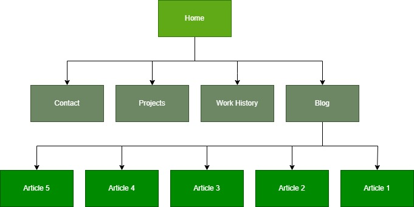
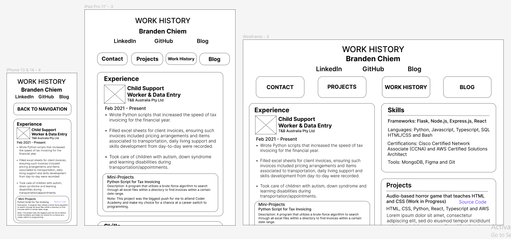
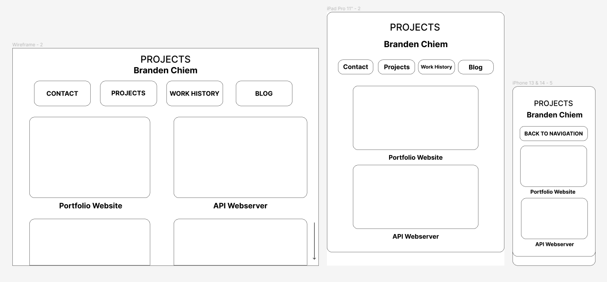
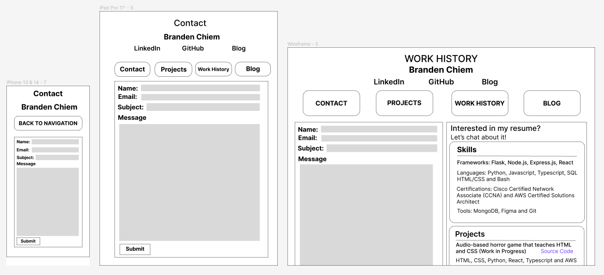
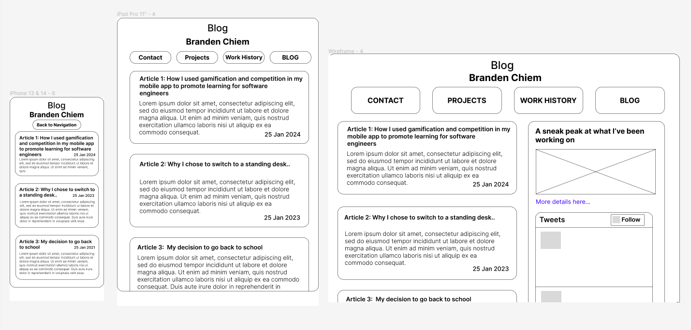
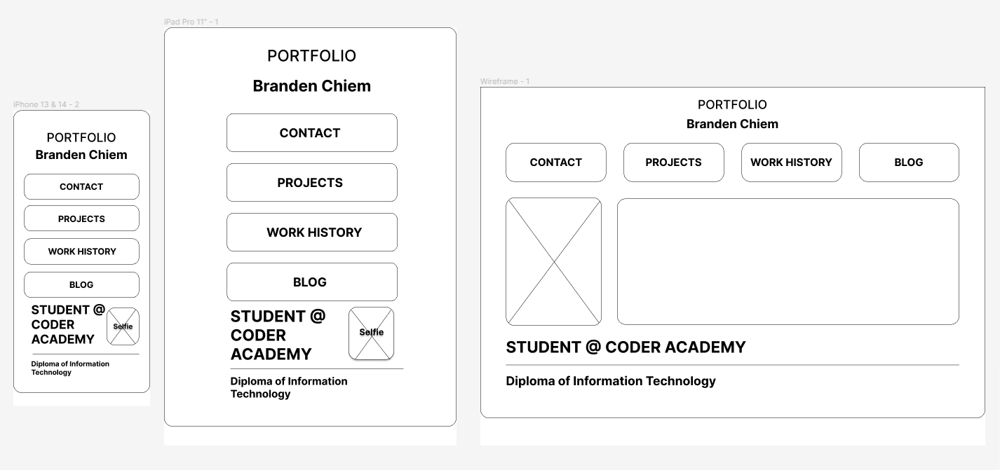
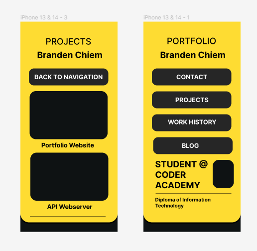
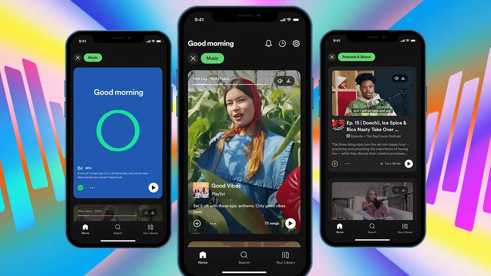
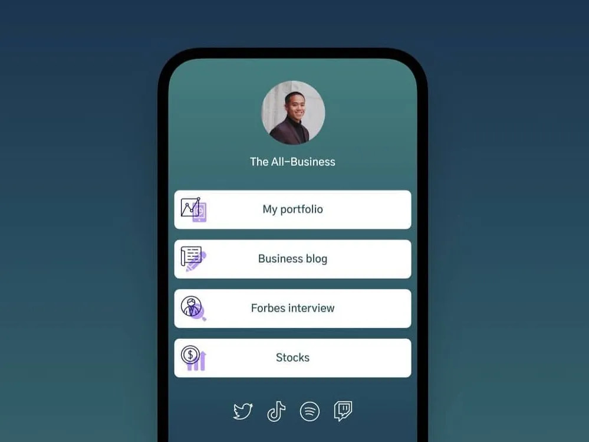

# Personal-Portfolio

[Github Repo](https://github.com/aztrocord/personal-portfolio)

This project was written for the purpose of being used as a professional portfolio that is easily accessible to employers.

The project was implemented solely with a tech stack of HTML and CSS, and the project boasts a simple but elegantly formatted header and navigation bar to personal projects, a work history and contacts page and a personal blog. The design of various parts of the site is loosely inspired by LinkedIn, LinkTree and Spotify.

## Website Structure

The overview of the portfolio website is as shown above. The homepage of the portfolio website features a navigation bar to various parts of the project.

## Portfolio Website Wireframes

## Inspirations

## References

* Figma (2024). Resource Library — Design Basics. [online] Figma.com. Available at: [Link to Resource Library](https://www.figma.com/resource-library/design-basics/).
